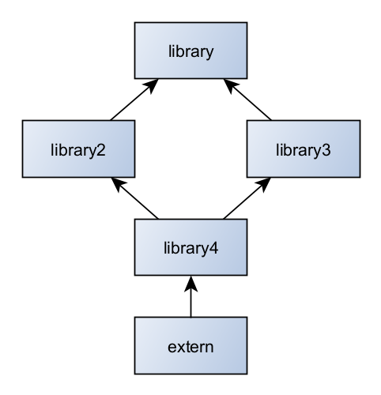

# cmake-library

Template of CMake files to build a static or shared library under Windows and Linux.

Needs of CMake 3.23:

  - `TARGET_RUNTIME_DLLS` lists all dynamic libraries (Windows only) dependencies of an executable. These DLL will be copy in the same path than the executable. Needs CMake 3.21.
  - `FILE_SET HEADER` to install header like `PUBLIC_HEADERS`. This new feature keeps tree path. The old solution is to `install DIRECTORY include/` but guidelines recommand to use explicit file and avoid wildcard. Needs CMake 3.23.

If you can't use latest CMake, you may have a look at [cxx-static-shared-example](https://github.com/friendlyanon/cxx-static-shared-example). It's another example with a branch for CMake 3.8 and CMake 3.12.

## Use cases

The goal of this template is to support the worst case.

There is a main library: `library`

Then two libraries depend on `library`: `library2`, `library3`.

And a final library `library4` that depends on `library2` and `library3`. It's a diamond dependency.

After, a simple executable `extern` is linked with `library4`.

## CMakeLists.txt

All interesting data in this POC are in `CMakeLists.txt` files in `library` folder. The other folders are just a clone of this folder to show that everything is working well for the worst scenario.

You need to know the basics of CMake. The whole [official tutorial](https://cmake.org/cmake/help/latest/guide/tutorial/index.html) is perfect.

The content in C++ source files is very simple.

To know how to build this example, simply follow instruction in `.github\workflows\cmake.yml` file.

## Typical problems this project handle

When using shared library, you need to define symbol `library_Export` when building library and undefining it when linking the library. It's automatically done when calling `add_library` in `SHARED` mode.

Under Windows with shared library, you need to copy all libraries in the same folder than the executable. `TARGET_RUNTIME_DLLS` generator-expression will help.

Diamond dependency doesn't look to be a problem with this example.

Don't explicitly (on user side) depends on `library` when linking `library2` or `library3`. But you need to explicitly do it in `Config.cmake` file.

## Fix-me

Don't set `CMAKE_INSTALL_RPATH` and `CMAKE_INSTALL_RPATH_USE_LINK_PATH` in `CMakeLists.txt`. But without it, CI don't pass.
